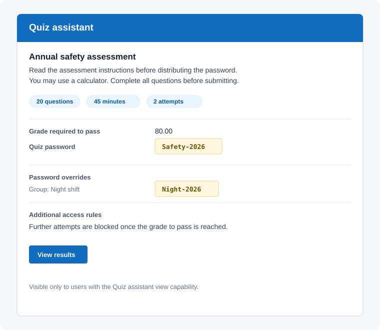

# Quiz assistant block

`block_quiz_assistant` gives authorised course staff a concise summary of every quiz in the current course.

Source code: <https://github.com/Operator-Training-Academy/moodle-block_quiz_assistant>

Support and bug reports: <https://github.com/Operator-Training-Academy/moodle-block_quiz_assistant/issues>

## Preview



## Requirements

- Moodle 5.0 or later.
- PHP version supported by the installed Moodle release.

## Installation

Install the ZIP package through Moodle's standard plugin installer, or install this repository as `blocks/quiz_assistant` in the Moodle code directory and then run:

```sh
php admin/cli/upgrade.php --non-interactive
php admin/cli/purge_caches.php
```

## Capabilities

| Capability | Default roles | Purpose |
|---|---|---|
| `block/quiz_assistant:addinstance` | Editing teacher, Manager | Add the block to a course page. |
| `block/quiz_assistant:view` | Teacher, Editing teacher, Manager | View quiz details and passwords. |
| `block/quiz_assistant:edit` | Editing teacher, Manager | Edit the block. |

The result-report link additionally requires Moodle's `mod/quiz:viewreports` capability for that quiz.

## Displayed Information

For every quiz in the course, the block displays:

- Quiz title with a link to the quiz.
- Full quiz introduction/instructions.
- Time limit, allowed attempts, grade required to pass, and number of questions.
- Default quiz password when one exists.
- Password-bearing group and user overrides. No override section is shown when none exist.
- Descriptions from active Moodle quiz access-rule plugins. This includes `quizaccess_failgrade` when it is enabled.
- A **View results** link for users with permission to view that quiz's reports.

The block does not render its quiz information for users without `block/quiz_assistant:view`.

## Documentation

This README is the plugin documentation. It covers installation, capabilities, displayed information, and verification.

## License

This plugin is licensed under the GNU General Public License v3.0 or later. See [LICENSE](LICENSE).

## Test Checklist

1. Create a course with a quiz containing instructions, a password, a time limit, an attempts limit, a grade to pass, and questions.
2. Add group and user password overrides.
3. Enable `quizaccess_failgrade` and confirm its access-rule description appears.
4. Confirm teachers can see details and the results link.
5. Confirm editing teachers can add and edit the block.
6. Confirm students and roles without `block/quiz_assistant:view` cannot see the quiz details.
